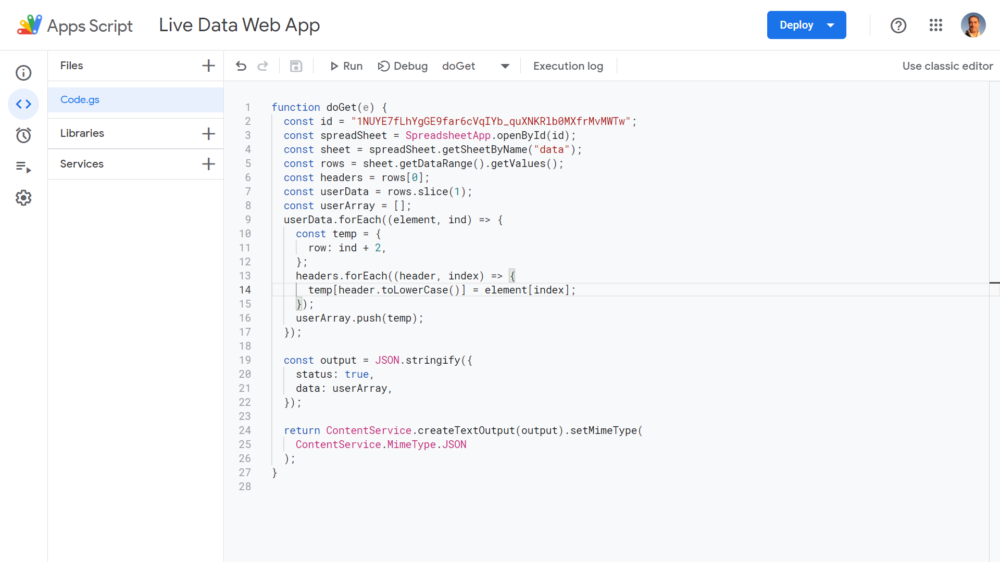
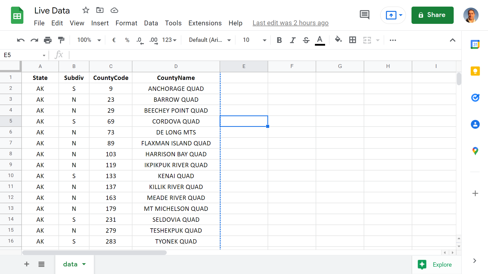

# :zap: Google Sheets JSON

* Javascript & Google Apps Script used as a backend to get data from a Google Sheets spreadsheet then convert to a JSON object array.
* **Note:** to open web links in a new window use: _ctrl+click on link_


## :page_facing_up: Table of contents

* [General info](#general-info)
* [Screenshots](#screenshots)
* [Technologies](#technologies)
* [Setup](#setup)
* [Features](#features)
* [Status](#status)
* [Inspiration](#inspiration)
* [Contact](#contact)

## :books: General info

* All code is written in Google Apps Script that is accessed from the menu of a Google Sheets spreadsheet
* `data.xls` shows the random technical data I used in a spreadsheet but any data could be used

## :camera: Screenshots




## :signal_strength: Technologies

* [Google Apps Scripts](https://developers.google.com/apps-script)

## :floppy_disk: Setup

* The Google Sheets document id has to be added as the const id in `convert_xls_json.js`
* Copy JS code into a Google Sheets spreadsheet Google Apps Script and run

## :wrench: Testing

* N/A

## :computer: Code Examples

* `convert_xls_json.js` forEach method to add the xls header data to a userData array

```javascript
  userData.forEach((element, ind) => {
    const temp = {
      row: ind + 2,
    };
    headers.forEach((header, index) => {
      temp[header.toLowerCase()] = element[index];
    });
    userArray.push(temp);
  });
```

## :cool: Features

* Converting xls to JSON data

## :clipboard: Status, Testing & To-Do List

* Status: Working
* To-Do: Nothing

## :clap: Inspiration

* [Google Apps Scripts documentation](https://developers.google.com/apps-script/guides/docs)

## :file_folder: License

* This project is licensed under the terms of the MIT license.

## :envelope: Contact

* Repo created by [ABateman](https://github.com/AndrewJBateman), email: gomezbateman@yahoo.com